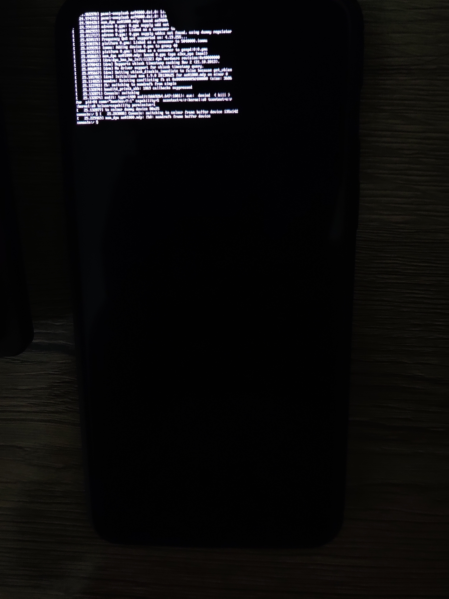
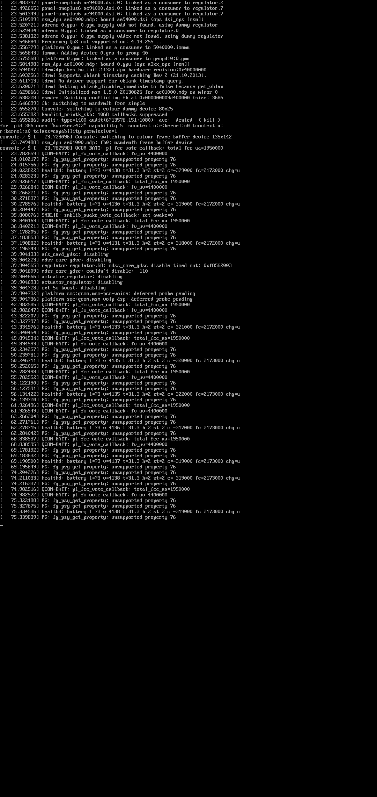

# MSM DRM/KMS 5.19 Backport for Downstream Kernels

This project provides a comprehensive backport of the **Qualcomm MSM DRM/KMS driver from Linux 5.19** to the **Downstream kernel bases**. 

It is designed to enable a modern, mainline-aligned graphics stack (DRM/KMS + Adreno) on legacy vendor kernels.

**Snapdragon 845 (SDM845)** platform is currently being tested on OnePlus 6/6T `enchilada`/`fajita`.

Here is the kernel I am using. Go check em out: [EdwinMoq](https://github.com/EdwinMoq/android_kernel_oneplus_sdm845/tree/lineage-23.2-4.19)
Kernel version: 4.19.

## Architecture

This driver is going to be a part of **Andrunix** (my main project), and it's going to utilize a **dual boot.img scheme** for running native Linux on Android hardware:

1.  **Standard Android Boot:** Uses the vendor kernel with KGSL/SDE for regular Android functionality.
2.  **Linux Desktop Boot:** Uses a modified Device Tree (DTB) where vendor KGSL and SDE nodes are stripped and replaced with mainline-aligned MDSS/Adreno nodes, backed by this **msm-drm-5.19** driver.

**NOTE:** This approach might eventually be changed to do a live swap while being booted into Android (I have patched SDE's uninit flow — just haven't gotten around to releasing it, yet.)

But for now, this approach avoids the extreme complexity of live SDE ↔ MSM driver switching, which is notoriously prone to unfixable teardown race conditions in downstream kernels.

## Key Features

### The Shim Layer (`msm/shims/`)
The core of this project is a sophisticated compatibility layer that bridges the gap between modern kernel APIs and downstream vendor implementations.

*   **Interconnect (ICC) Shim:** Provides a 1:1 mapping of modern `of_icc_get()` and `icc_set_bw()` APIs onto the downstream `msm_bus_scale` framework. Supports both synchronous and asynchronous bandwidth scaling.
*   **OPP (Operating Performance Points) Shim:** A custom implementation of the modern OPP layer. It unifies frequency scaling (`clk_set_rate`) and interconnect bandwidth voting into a single `dev_pm_opp_set_opp()` call, matching 5.19 behavior.
*   **DRM Helper Backports:** Ported modern DRM core features missing in 4.19:
    *   `drm_plane_create_blend_mode_property`
    *   `drm_writeback_connector_init_with_encoder`
    *   `drm_firmware_drivers_only()` (via raw cmdline parsing)
    *   Atomic plane state reset and reset helpers (`__drm_atomic_helper_plane_reset`).

### Display Pipeline (DPU/DSI)
*   **Mainline DPU Driver:** Ported from 5.19, providing modern plane, CRTC, and encoder management.
*   **DSI PHY & Host:** Full support for 10nm DSI PHYs with mainline-style link/pixel clock management.
*   **OPP-Based Timings:** Implements `msm_dsi_clamp_to_opp` to ensure pixel clocks are correctly clamped to valid OPP ranges, preventing RCG misbehavior common in downstream kernels.
*   **SMMU Fault Fixes:** Resolved translation faults (NULL TTBR0/TTBR1) by implementing robust IOMMU domain fallback logic and context bank handling for downstream SMMU drivers.
*	**Panel Initialization & Signaling:** Resolved downstream-specific panel timeout conditions during the DSI pre-enable/enable sequence, ensuring proper clock/regulator locking before panel handoff.
### ⚠️ Critical insight:
This one is a very specific Android quirk.
On the Snapdragon 845 platform, **all DSI command execution utilizes the Command-DMA engine**, regardless of whether the payload is a short 4-byte or a long 8-byte write.
#### Quick Explanation:
* **Panel Initialization & Signaling:** Resolved downstream-specific panel timeout conditions during the DSI pre-enable/enable sequence, ensuring proper clock/regulator locking before panel handoff.

### ⚠️ The CAF Header Inversion Quirk (Command-DMA Timeout Fix)
On Qualcomm Snapdragon platforms, **all DSI command execution utilizes the Command-DMA engine**, regardless of packet length (short 4-byte writes vs. long multi-byte writes). 

The CPU writes the packet to system RAM, maps it via the Display SMMU domain over the high-speed AXI interconnect bus (`DISP_CC_MDSS_AXI`), and tells the DMA engine to pull it. The driver then waits for a hardware interrupt signaling completion.

During testing, short writes succeeded, but long writes hit an immediate, unrecoverable `-ETIMEDOUT` hang (`STATUS0` stuck at `CMD_DMA_BUSY`). 

#### The Root Cause: Mainline vs. Android CAF Array Layout
The upstream 5.19 MSM driver relies on standard Linux core definitions where the MIPI DSI header bytes are arranged sequentially starting at index `0`. However, downstream Android CAF kernels **flipped the byte ordering** of the packet header inside `mipi_dsi_create_packet()`:

| Kernel Tree | `header[0]` | `header[1]` | `header[2]` |
| :--- | :--- | :--- | :--- |
| **Linus Mainline(Inclusive of 4.19)** | Data ID (DI) | Word Count LSB / Param 0 | Word Count MSB / Param 1 |
| **Android CAF 4.19** | Word Count LSB / Param 0 | Word Count MSB / Param 1 | Data ID (DI) |

Because the upstream `dsi_cmd_dma_add()` packed these bytes into the MSM hardware command DWORD assuming mainline ordering, the CAF core helper scrambled the layout. Short writes survived because the DSI engine ignores the Word Count fields for fixed-length short packets. Long writes, however, received a giant garbage Word Count value (e.g., `0x3900`), causing the DMA hardware engine to loop indefinitely waiting for a massive payload that didn't exist.
It's really understanding the problem because the fix is trivial. All it takes is a simple shim (`msm_dsi_create_packet`) which creates the packet as intended without needing to modify core CAF function.

### GPU (Adreno 630 / A6xx)
*   **CX Power Domain:** Fixed unmanaged CX domain sequencing by backporting 6.x-style `dev_pm_domain_attach_by_name` logic to ensure power is available before any GMU register access. Originally, the 5.19 driver didn't manage the CX domain; this was ported from 6.x.x.
*	**GMU Register Access:** Resolved initial crashes during `gmu_resume` (gmu_read/gmu_write are now functional).

## Implementation Highlights (Fixes & Hacks)

This backport includes several targeted fixes to address downstream-specific behavior:

*   **Aperture Conflict Resolution:** Implements `msm_aperture_remove_framebuffers()` to cleanly evict the bootloader-initialized simplefb/framebuffer before DRM takes over, preventing memory contention.
*   **Runtime CX Enabling:** Introduced `dev_gdsc_enable()` in `msm_mdss.c` and `a6xx_gmu.c` to allow manual GDSC management when the module is loaded post-boot (insmod).
*   **Performance State Sanitization:** Added logic to ensure performance state votes are correctly reset to 0 during runtime suspend in `dpu_kms.c` and `dsi_host.c`, preventing power leakage.

## Current Status:

**NOTE:** Do NOT expect it to **just work** unless you are on a high enough kernel version. The core driver is functional meaning the panel lights up EXCEPT for the GPU/GMU pipeline.

*   **Probing:** Driver probes and initializes fully.
*   **Display:** `modetest` works (as long as gmu_resume is never touched). Early framebuffer hand-off works and the panel does infact light up.

---

  
   
  <em>The OnePlus 6 panel successfully lighting up using the backported mainline display pipeline. </em>

(I don't really have a good device to take photos, please excuse my terrible photography skills 🙃)

---
---

  
   
  <em>Raw <code>fbgrab</code> frame buffer dump (Kernel 4.19.255)</em>

---

*   **IOMMU:** Translation and context bank allocation are stable.
*	**GPU:** GMU register access and `gmu_resume` are functional. However, a ringbuffer drain timeout occurs during GPU hardware initialization (`adreno_load_gpu` failing with `-22`), leading to a Command Processor (CP) opcode error (`possible opcode=0x70E60001`) and a subsequent kernel NULL pointer dereference panic during hangcheck recovery.

## 🛠️ Integration

1.  Copy the `msm/` directory into `drivers/gpu/drm/msm/`.
2.  Backport the mainline MDSS/DPU Device Tree (DT) for your SoC..
	- You can use mine as a reference check: `dtbs/sdm845-oneplus-common.dtsi`-that's the main backport. `dtbs/sdm845-oneplus-enchilada.dtsi` and `dtbs/sdm845-oneplus-fajita.dtsi` build upon that.
	- **Quick FYI:** The `dtbs` folder in this repo is direct copy of the one from EdwinMoq's kernel repo.
3.  **Note:** Requires manual additions to `struct drm_plane_state` in `include/drm/drm_plane.h` for `pixel_blend_mode` support (see `msm/shims/NOTE.md` for details).

## 📄 Technical Documentation
See [msm/shims/NOTE.md](msm/shims/NOTE.md) for a deep dive into specific implementation hacks, SMMU fault analysis, and comparison with 4.19/5.4/5.18 MSM drivers along with how to get genpd power-domains to work.
