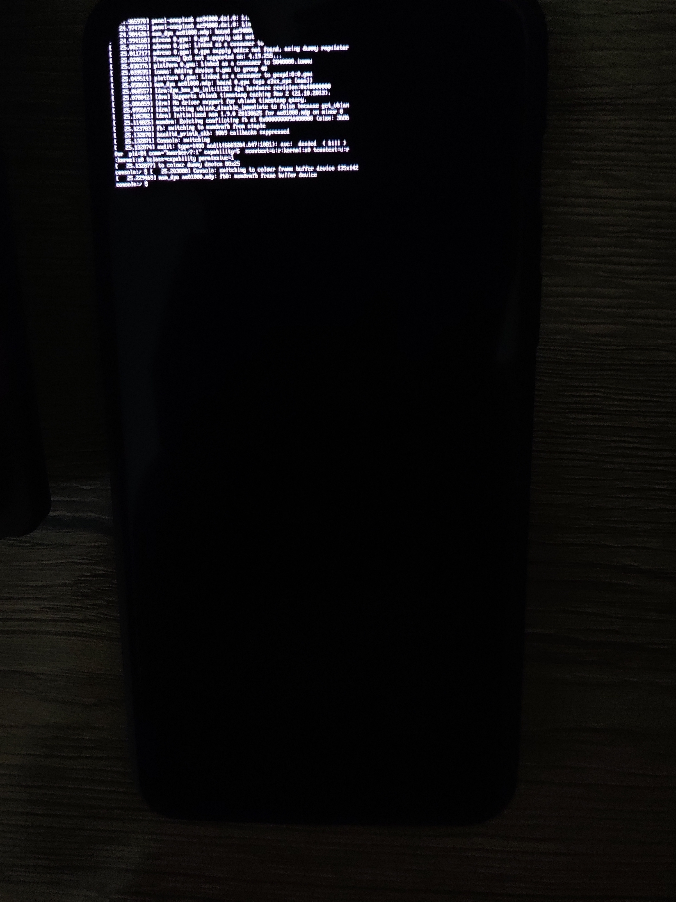
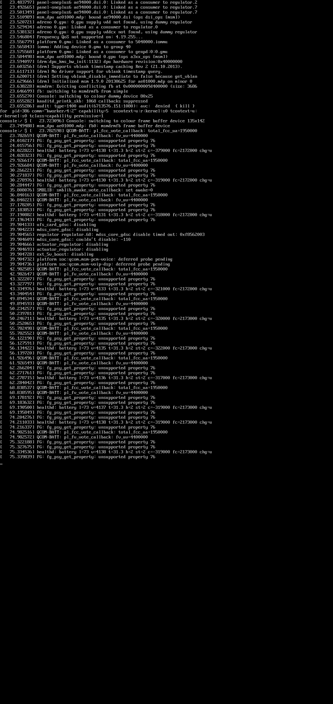

# MSM DRM/KMS 5.19 Backport for Downstream Kernels

This project provides a comprehensive backport of the **Qualcomm MSM DRM/KMS driver from Linux 5.19** to **Downstream kernel bases**.

> **About the Project:** Built and maintained by an 18-year-old self-taught systems developer.

**Note:** 4.19 is just the floor. In the future this module will support >=4.19 kernel versions as well.

It is designed to enable a modern, mainline-aligned graphics stack (DRM/KMS + Adreno) on legacy vendor kernels.

**Snapdragon 845 (SDM845)** platform is currently being tested on OnePlus 6/6T `enchilada`/`fajita`.

Here is the kernel I am using. Go check em out: [EdwinMoq](https://github.com/EdwinMoq/android_kernel_oneplus_sdm845/tree/lineage-23.2-4.19)
Kernel version: `4.19.255`

---

# CURRENT STATUS:
**STABLE, as of July 4th 2026, 11:49pm.** The core driver architecture and hardware acceleration subsystems are fully functional. The stuff I have tested is `kmscube` and Sway window manager so far.

**MSM module source:** Upstream Linux 5.19
**My panel version** Upstream Linux 6.6
**Kernel version(The one I am on):** Downstream 4.19.255 - For Oneplus6/6T by EdwinMoq

### 🟢 Baseline & Core Subsystems
* **MDSS/DPU Pipeline:** Fully functional. Hardware interfaces probe flawlessly, `modetest` queries complete successfully, and early bootloader framebuffer hand-off transitions beautifully into the legacy TTY console (`/dev/fb0`).
* **SMMU Layer:** Stable. IOMMU context banks are mapped and allocated safely.
But most importantly, the panel lights up!

### 🟢 GPU & GMU Status
* **GMU Register Access:** **RESOLVED.** Overcame the blind hard-locking state during `gmu_resume` register reads/writes. Address spacing was incorrect in the device tree blobs (I am so stupid 🙃)
* **Zap shader init:** **FIXED.** On downstream you need `pil_gpu` enabled because that's how the trust zone driver probes pas-id XX and authenticates the zap at boot.
* **DRM Scheduler:** **BACKPORTED & WORKING.** Pulled the 5.19 scheduler core into `scheduler/`. The GPU now actually renders — `kmscube --gears` spins a cube at a locked **60 fps**.
* **DRM SYNCOBJ:** **BACKPORTED** Pulled from 5.19 (alomg with `dma-fence-chain`) and hooked up into `msm_gem_submit.c`

### 🟢 Rendering:
* **kmscube:** Works.
* **Sway:** Vulkan backend renderer actually renders to the screen.

---

# Why This Exists: The Great DRM/KMS Divide (Android Bionic vs Standard Linux Glibc)

**Note:** This is gonna be a bit of a history lesson.

For over a decade, developers and open-source communities have tried to run standard GNU/Linux on modern smartphone hardware. Historically, this has divided the community into two camps, each representing a massive compromise.

## The History

1. **The Middle-Ground (The `libhybris` Era):**
   Originating around 2012 within the Mer project (and popularized by Jolla for Sailfish OS and Canonical for Ubuntu Touch), `libhybris` was a brilliant hack. It allowed glibc-based Linux userspace programs to load and call Android’s Bionic C-library-linked proprietary graphics blobs. However, wrapping Android’s Hardware Abstraction Layers (HALs) and translating EGL calls meant dealing with significant compatibility shims, translation overhead, and complex dependency structures. Over time, maintaining this Bionic-to-Glibc bridge became a massive maintenance burden.

2. **The Purist-Ground (The Mainlining Movement):**
   Around late 2017, "mainlining" was gaining serious momentum. Led by legendary Linux enthusiast communities like postmarketOS (pmOS), a massive push was made to break free from Android's bloated downstream vendor kernels completely. The goal? Run a pure, upstream mainline Linux kernel on phones.

3. **Google's Official AVF:**
   Finalized with Android 13 on Pixel devices (and mandated for many ARMv9 devices on Android 14+), AVF leverages **pKVM (Protected KVM)**. Instead of just exposing raw KVM, pKVM enforces strict, cryptographically backed memory isolation between the Android host and the guest VM (typically running Google's stripped-down "Microdroid" OS). While great for running secure DRM keys or isolated code, it's essentially a brick wall if you want a seamless, high-performance desktop Linux environment.

If you couldn't already tell; **This project is my attempt at solving this complex gap.**

**My take on the existing options:** I've always had this passion for a "perfect world" where I don't have to choose between Android or Linux for my phone's OS. And yes, I'm sure we've all had this exact thought. While looking at these options, I really wanted to lean towards upstreaming, as it's undoubtedly the best path in my opinion. No matter how broken upstream might be. pmOS single-handedly supports more devices than any other project, especially when we talk about downstream devices. The other options aside from mainlining just add a shit-ton of userspace fragmentation and or introduce latency.
Criticizing both, I had a thought. What if we just... swapped drivers? Stay downstream but use the mainline driver at runtime. Unbind KGSL and SDE, `insmod` the panel and `msm` driver and... I'm sure you can imagine where this is going.

Now, of course, this approach does *not* work out of the box and requires patching the SDE driver (I still haven't uploaded the patches because I am unbelievably lazy 😭). But for my "perfect world" scenario? It's still way better than hacking half my userspace.

**This project is my attempt at solving that gap.**

## Comparisons

| Approach | What you get | What it costs |
| :--- | :--- | :--- |
| **libhybris** | Android's blobs, callable from a Linux userspace | **Translation overhead** — every graphics call is routed through an intermediate compatibility layer. For example, standard Linux EGL/GBM calls from a Wayland compositor (like Weston) are intercepted, translated, and marshaled into Android-specific `gralloc` or `hwcomposer` calls before reaching the proprietary blobs, destroying native performance. |
| **AVF / KVM** | A real Linux guest, isolated | **Virtualization overhead*** — you're virtualizing an entire secondary kernel just to display a desktop. Good luck getting working GPU passthrough on a mobile SoC (a complete nightmare for the pure `KVM` path). |
| **Full Mainlining** | Real upstream kernel, zero overhead | **No Android** — if your device isn't already mainlined, you're forced to reverse-engineer everything yourself. Otherwise, you're at the mercy of half-baked (sometimes they absolutely do work) community drivers, battery drain, broken hardware keys, and overheating issues. |
| **This Backport** | Real upstream-model driver (Your kernel's stock DRM/KMS + modern 5.19 scheduler), zero overhead, vendor blobs still work | **My sanity.** |

***

Nah, I'm just kidding. In all seriousness, this was actually a pretty fun learning experience. It was definitely frustrating at times and quite stressful through the month of June (college finals, poorly scheduled university entrance exams, and three other equally annoying, difficult tasks was a surefire way to hit mid-month burnout. Yes, I did this during exams. 🙃)

---
---


# Architecture

This driver is going to be a part of **Andrunix** (my main project), and it's going to utilize a **dual boot.img scheme** for running native Linux on Android hardware:

1. **Standard Android Boot:** Uses the vendor kernel with KGSL/SDE for regular Android functionality.
2. **Linux Desktop Boot:** Uses a modified Device Tree (DTB) where vendor KGSL and SDE nodes are stripped and replaced with mainline-aligned MDSS/Adreno nodes, backed by this **msm-drm-5.19** driver.

**NOTE:** This approach might eventually be changed to do a live swap while being booted into Android (I have patched SDE's uninit flow — just haven't gotten around to releasing it, yet.)

But for now, this approach avoids the extreme complexity of live SDE ↔ MSM driver switching, which is notoriously prone to unfixable teardown race conditions in downstream kernels.

## Key Features

### The Shim Layer (`msm/shims/`)
The core of this project is a sophisticated compatibility layer that bridges the gap between modern kernel APIs and downstream vendor implementations.

*   **Interconnect (ICC) Shim:** Provides a 1:1 mapping of modern `of_icc_get()` and `icc_set_bw()` APIs onto the downstream `msm_bus_scale` framework. Supports both synchronous and asynchronous bandwidth scaling.
*   **OPP (Operating Performance Points) Shim:** A custom implementation of the modern OPP layer. It unifies frequency scaling (`clk_set_rate`) and interconnect bandwidth voting into a single `dev_pm_opp_set_opp()` call, matching 5.19 behavior.
*   **DRM Helper Backports:** Ported and also custom made modern DRM core features missing in 4.19:
    *   `drm_plane_create_blend_mode_property` -> (ported)
    *   `drm_writeback_connector_init_with_encoder` -> (custom made)
    *   `drm_firmware_drivers_only()` (via raw cmdline parsing) -> (custom made)
    *   Atomic plane state reset and reset helpers (`__drm_atomic_helper_plane_reset`). -> (ported)

### Display Pipeline (DPU/DSI)
*   **Mainline DPU Driver:** Ported from 5.19, providing modern plane, CRTC, and encoder management.
*   **DSI PHY & Host:** Full support for 10nm DSI PHYs with mainline-style link/pixel clock management.
*   **SMMU Fault Fixes:** Resolved translation faults (NULL TTBR0/TTBR1) by implementing IOMMU domain fallback logic and context bank handling for downstream SMMU drivers.
*	**Panel Initialization & Signaling:** Resolved downstream-specific panel timeout conditions during the DSI pre-enable/enable sequence, ensuring proper clock/regulator locking before panel handoff. (Best example for this is manually shifting Panel regulators from LPM to HPM mode.)

### GPU (Adreno 630 / A6xx)
*   **CX Power Domain:** Fixed unmanaged CX domain sequencing by backporting 6.x-style `dev_pm_domain_attach_by_name` logic to ensure power is available before any GMU register access. Originally, the 5.19 driver didn't manage the CX domain; this was ported from 6.x.x.

### Backports:
**DRM DSC:** Quick and easy backport-ensured that the core driver DSI and DPU implementation are happy, allowing for clean compilation and functionality.
**DRM Scheduler:** Backported the 5.19 GPU scheduler core into `scheduler/` so the modern engine job model maps cleanly onto the 4.19 base. This is what took the GPU from "idles forever" to actually executing the ringbuffer and rendering.
**DRM SYNCOBJ:** Backported the 5.19 drm_syncobj chain to ensure modren versions of Vulkan would actually work.

## Implementation Highlights (Fixes & Hacks)

This backport includes several targeted fixes to address downstream-specific behavior:

*   **Aperture Conflict Resolution:** Implements `msm_aperture_remove_framebuffers()` to cleanly evict the bootloader-initialized simplefb/framebuffer before DRM takes over, preventing memory contention.
*   **Runtime CX Enabling:** Introduced `dev_gdsc_enable()` in `msm_mdss.c` and `a6xx_gmu.c` to allow manual GDSC management when the module is loaded post-boot (insmod).
*   **Performance State Sanitization:** Added logic to ensure performance state votes are correctly reset to 0 during runtime suspend in `dpu_kms.c` and `dsi_host.c`, preventing power leakage.

Now, while this is all sunshine and rainbows I do have two points:
*	**Lack of Shim Layer Maturity:** No way in hell are the shims ready for any `>4.19` KVER... yet (In the future they will be)
*	**Work In Progress:** While the module works great as is. There are plenty of improvements to come.

**=>** See **[SHOWCASE.md](SHOWCASE.md)** for the `modetest`, `kmscube --gears` logs, bring-up `dmesg`, and the demo.

*	**Probing:** Driver probes and initializes fully.
*	**Display:** Early framebuffer hand-off works and the panel does in fact light up:

---

<p align="center">
  
  <br>
  <em>The OnePlus 6 panel successfully lighting up using the backported mainline display pipeline. </em>
</p>
(I don't really have a good device to take photos, please excuse my terrible photography skills 🙃)

---
---

<p align="center">
  
  <br>
  <em>Raw <code>fbgrab</code> frame buffer dump (Kernel 4.19.255)</em>
</p>

---

*	**IOMMU:** Translation and context bank allocation are stable.
*	**GPU & GMU Core:** The GMU successfully handles its power sequences, register domains are stable, firmware validation passes, and the GPU spins up directly into a clean engine idle loop.
*	**DRM Scheduler:** **BACKPORTED & WORKING.** The 5.19 scheduler core now lives in `scheduler/` (`sched_main.c`, `sched_entity.c`, `sched_fence.c`), replacing 4.19's — which was too old to map the modern engine job model onto and would NULL-deref inside `drm_sched_entity_pop_job` the moment real work hit it.
*	**Rendering:** Working. The full chain — GPU submit → DRM scheduler → ringbuffer → atomic KMS flip — is live end to end.

## 🛠️ Integration

1.  Copy the `msm/` directory into `drivers/gpu/drm/msm/`.
2.  Backport the mainline MDSS/DPU Device Tree (DT) for your SoC..
	- You can use mine as a reference check: `dtbs/sdm845-oneplus-common.dtsi`-that's the main backport. `dtbs/sdm845-oneplus-enchilada.dtsi` and `dtbs/sdm845-oneplus-fajita.dtsi` build upon that.
	- **Quick FYI:** The `dtbs` folder in this repo is direct copy of the one from EdwinMoq's kernel repo.
3.  **Note:** Requires manual additions to `struct drm_plane_state` in `include/drm/drm_plane.h` for `pixel_blend_mode` support (see `msm/shims/NOTE.md` for details).
4. Copy the `scheduler/` directory directly into `drivers/gpu/drm/` and append the compilation target to `drivers/gpu/drm/Makefile`:
```
obj-$(CONFIG_DRM_SCHED) += scheduler/
```
Additionally, you might also need to add this to `drivers/gpu/drm/Kconfig`:
```
config DRM_SCHED
    tristate "DRM GPU Scheduler"
    depends on DRM
```

## 📄 Technical Documentation
* See [setup.md](setup.md) for a brief guide on how to get genpd power-domains to work and pixel blending to work.
* See [fixes.md](fixes.md) for a deep dive into specific fixes, implementation, hacks and SMMU fault analysis.
* See [SHOWCASE.md](SHOWCASE.md) for the userspace proof — `modetest`, `kmscube --gears` at 60 fps, bring-up `dmesg`, and (eventually) a video of the whole `insmod` → `modetest` → `kmscube` run.
